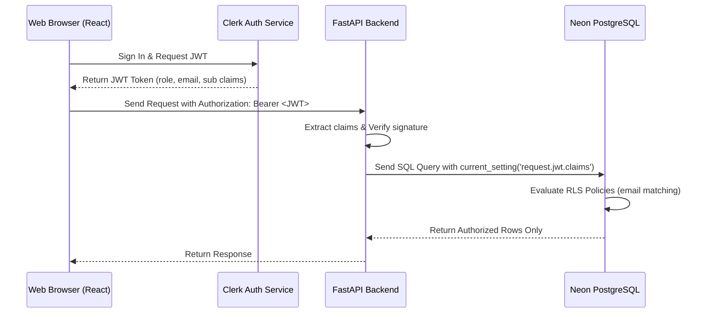

# Clerk Authentication & Neon Row-Level Security (RLS) Setup Guide

This guide details how to replace the developer mock authentication system with a fully functional production-grade setup using **Clerk** on the frontend and **Neon Authorize** with Postgres **Row-Level Security (RLS)** on the database layer.

---

## 🏗️ Architectural Flow



---

## 1. Frontend Integration (Clerk React)

1. Install Clerk SDK:
   ```bash
   cd frontend
   npm install @clerk/clerk-react
   ```
2. Wrap your `App` inside `ClerkProvider` in `frontend/src/main.jsx`:
   ```javascript
   import { ClerkProvider } from '@clerk/clerk-react';
   
   const CLERK_PUBLISHABLE_KEY = import.meta.env.VITE_CLERK_PUBLISHABLE_KEY;
   
   ReactDOM.createRoot(document.getElementById('root')).render(
     <React.StrictMode>
       <ClerkProvider publishableKey={CLERK_PUBLISHABLE_KEY}>
         <App />
       </ClerkProvider>
     </React.StrictMode>
   );
   ```
3. Update API headers in your React fetch/axios requests to send the active session JWT token:
   ```javascript
   import { useAuth } from '@clerk/clerk-react';
   
   function useSecureAPI() {
     const { getToken } = useAuth();
     
     const secureFetch = async (url, options = {}) => {
       const token = await getToken({ template: "neon_rls" }); // Custom JWT template name
       return fetch(url, {
         ...options,
         headers: {
           ...options.headers,
           "Authorization": `Bearer ${token}`
         }
       });
     };
     
     return secureFetch;
   }
   ```

---

## 2. Clerk Dashboard Configuration

To send the correct database fields in the token payload:
1. Go to your **Clerk Dashboard** > **JWT Templates** > **New Template** > Select **Blank**.
2. Name the template `neon_rls`.
3. In the JSON editor, map the claims you want to expose to your FastAPI backend and Neon database:
   ```json
   {
     "sub": "{{user.id}}",
     "email": "{{user.primary_email_address}}",
     "role": "{{user.public_metadata.role}}"
   }
   ```
4. Save the template. Note the **JWKS Endpoint URL** (e.g. `https://clerk.yourdomain.com/.well-known/jwks.json`).

---

## 3. Neon Postgres RLS Setup (Neon Authorize)

1. Open your project in the **Neon Console**.
2. Go to **Project Settings** > **Authorize** (Authentication).
3. Click **Add Provider** and paste the **JWKS Endpoint URL** from Clerk.
4. Neon will verify incoming JWT signatures automatically.
5. In your SQL Editor, enable **Row-Level Security** on your transactional tables:
   ```sql
   -- Enable RLS on claims table
   ALTER TABLE claims ENABLE ROW LEVEL SECURITY;
   ```
6. Create an RLS policy that restricts users to viewing only their own claims:
   ```sql
   CREATE POLICY select_user_claims ON claims
   FOR SELECT
   USING (
     customer_id::text = (current_setting('request.jwt.claims', true)::json->>'sub')
     OR 
     'claim_officer' = (current_setting('request.jwt.claims', true)::json->>'role')
   );
   ```
7. This policy enforces that:
   - **Customers** can only query claim rows that match their own Clerk `userId` (`sub`).
   - **Claims Officers** bypass this restriction and can query all claims for auditing.

---

## 4. Backend Configuration (FastAPI)

To enforce Clerk JWT verification, add your Clerk JWKS URL to your production environment variables:
```env
CLERK_JWKS_URL=https://api.clerk.com/v1/historical-jwks-endpoint
```
The [auth.py](backend/app/db/auth.py) module will automatically decode the token, search for/create the user matching the email, and verify role clearance. 

If this variable is left empty, the backend runs in **Local developer bypass mode** (mapping requests to default seed database users automatically), making local demos simple and fast.
