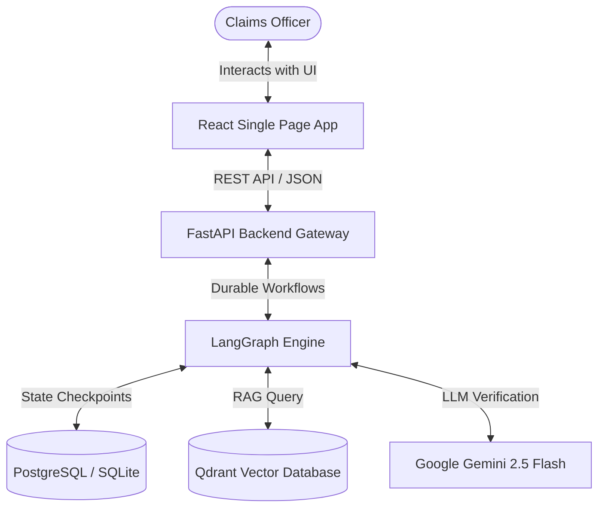
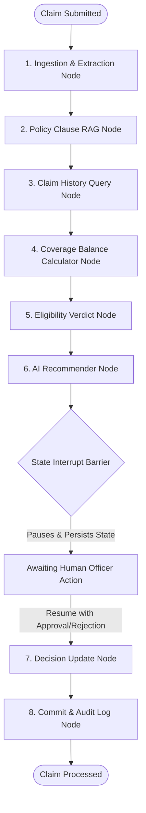

# Insurance Claim Processing Agent (HITL Multi-Agent System)

An enterprise-grade, human-in-the-loop (HITL) insurance claims validation and processing platform. This system utilizes a multi-agent workflow to ingest claim invoices, perform policy clause lookups via RAG, calculate eligibility limits, compile mathematical balances, and pause execution for human officer review.

Built using **LangGraph**, **FastAPI**, **React (Vite)**, **Qdrant Vector DB**, and **PostgreSQL/SQLite**.

---

## 🏗️ System Architecture

The platform consists of a modern decoupled architecture:
1. **Frontend (React)**: A glassmorphic dashboard built with Tailwind CSS/Vanilla CSS, featuring real-time claims queues, interactive audit review drawers, and detailed explainability panels.
2. **Backend API (FastAPI)**: REST endpoints managing claims lifecycles, user authentication, file uploads, and LangGraph workflow instances.
3. **Orchestration (LangGraph)**: A stateful, multi-node agent network with checkpoint-based state persistence to handle durable execution pauses.
4. **Vector Search (Qdrant)**: Stores and searches through policy documents using metadata filters to retrieve relevant clauses (waiting periods, exclusions).
5. **Relational Database (PostgreSQL/SQLite)**: Manages relational data for users, policies, claims history, and granular audit trails.

### Component Diagram



### Agent Workflow Diagram

The LangGraph workflow runs sequentially across specialized, single-responsibility nodes. It pauses at the **Human Review Barrier** to await officer feedback, resuming state seamlessly:



---

## 🚀 Advanced AI Engineering Portfolio Features

This platform showcases production-grade AI engineering patterns that go beyond basic LLM wrappers:

1. **Stateful Graph Interrupts (LangGraph)**: Utilizes a persistent SQLite checkpointer memory to handle state management across human-in-the-loop validation barriers. The claim audit pipeline automatically pauses at the `Pause` barrier, persisting intermediate states until an underwriter resumes execution via human approval sign-off.
2. **Advanced Semantic RAG Engine**:
   - **Query Expansion**: Uses Gemini to expand simple treatment queries into 3 distinct clinical synonyms to maximize vector database lookup recall.
   - **Qdrant Metadata Filtering**: Restricts searches dynamically to document partitions matching the active `policy_id`.
   - **LLM-Based Re-ranking**: Integrates a structured Gemini scorer to de-duplicate and sort retrieved clauses by clinical relevance, keeping only the top 3 high-confidence rules.
3. **Automated LLM-as-a-Judge Evaluations**: Programmatically tests a suite of claims scenarios (under limit, waiting periods, general exclusions, over limit) and sends output states to a secondary LLM judge to verify arithmetic, clinical reasoning, and decision accuracy.
4. **LangSmith Trace & Dataset Integration**: Integrates the `langsmith` Client SDK to automatically register the verification dataset on the LangSmith dashboard, upload test cases, and log traced diagnostic executions.
5. **Role-Based Access Control (RBAC) & Secure Demo Bypass**:
   - Integrates **Clerk JWT authorization** natively with backend FastAPI dependencies.
   - **Granular Data Isolation**: Restricts API endpoints so Patients can only view claims they submitted, while Claims Officers manage the system underwriting queue.
   - **Interactive Persona Login Selector**: Features a premium business landing page with toggleable personas for seamless offline developer testing without third-party dependencies.

---

## 📸 Interface Preview

### 1. Claims Operations Dashboard
*A glassmorphic dashboard showcasing top-level KPI metrics, real-time claim queues, and quick filters.*


### 2. Human-in-the-Loop Verification Drawer
*The evaluation panel demonstrating the RAG-retrieved policy rules, math verification checklist, and the action-form to approve or reject the claim.*


---

## 🗄️ Database Schema

The system uses **SQLModel** (SQLAlchemy + Pydantic) to model relational data:

- **`User`**: Account info, password hashes, and user roles (`customer`, `officer`).
- **`Policy`**: Holds policy definitions, coverages, limits, and document links.
- **`Claim`**: Tracks claim details, invoice data, extracted values, AI verdicts, and current status (`Pending`, `Awaiting_Review`, `Approved`, `Rejected`).
- **`AuditLog`**: Logs chronological state transitions, execution actions, and officer notes for compliance.

---

## 🚀 Quick Start (Local Setup)

### Prerequisites
- Python 3.10+
- Node.js 18+
- (Optional) Docker

### 1. Backend Setup
Navigate to the `backend` folder, set up a virtual environment, and install dependencies:
```bash
cd backend
python -m venv venv
source venv/Scripts/activate # Windows: .\venv\Scripts\Activate.ps1
pip install -r requirements.txt
```

Create a `.env` file in the `backend/` directory:
```env
DATABASE_URL=sqlite:///./claims.db
GEMINI_API_KEY=your_gemini_api_key
QDRANT_URL=http://localhost:6333

# Optional: LangSmith Observability Tracing
LANGCHAIN_TRACING_V2=false
LANGCHAIN_API_KEY=your_langsmith_api_key
LANGCHAIN_PROJECT=insurance-claims-processing
```
> **Note**: If no `GEMINI_API_KEY` is provided, the backend automatically engages deterministic regex parsers and mock vector generators to allow running fully offline.


Start the backend:
```bash
uvicorn app.main:app --reload --port 8000
```

### 2. Frontend Setup
Navigate to the `frontend` folder and install dependencies:
```bash
cd ../frontend
npm install
```

Start the Vite development server:
```bash
npm run dev
```

---

## 🐳 Docker Deployment (All Services)

You can spin up the entire application stack—including Qdrant, the API, and the React frontend—using Docker Compose.

1. Ensure your root `.env` is configured.
2. Spin up the containers:
   ```bash
   docker-compose up --build
   ```
3. Open:
   - Frontend app: `http://localhost:3000`
   - Swagger API docs: `http://localhost:8000/docs`
   - Qdrant Dashboard: `http://localhost:6333/dashboard`

---

## 🧪 Testing & Evaluation

### 1. Automated Unit Tests (pytest)
Unit tests bypass external database setups and test the core LangGraph state transitions and API endpoints using an in-memory SQLite setup:
```bash
cd backend
python -m pytest
```

### 2. LLM-as-a-Judge Evaluation Suite
We have built an automated evaluation suite to test the quality of recommendations, eligibility verdicts, and coverage calculations across multiple claim scenarios:
```bash
cd backend
python -m app.evals.eval_runner
```
*   **Dataset**: Loaded from [dataset.json](file:///C:/Users/Utkarsh%20Raj/.gemini/antigravity/scratch/insurance-claim-processing-agent/backend/app/evals/dataset.json) covering standard, over-limit, general exclusion, and waiting period claims.
*   **Methodology**: Runs mock claims through the full LangGraph pipeline using tool mocking and sends output payloads to a secondary Gemini LLM judge.
*   **Report**: Compiles and outputs scores and justifications to a markdown summary at [eval_report.md](file:///C:/Users/Utkarsh%20Raj/.gemini/antigravity/scratch/insurance-claim-processing-agent/backend/app/evals/eval_report.md).

---

## 🌐 Deploying to the Web
For detailed, step-by-step instructions on deploying the project for free (using **Neon PostgreSQL**, **Render**, and **Vercel**), refer to our [Deployment Guide](deployment_guide.md).
